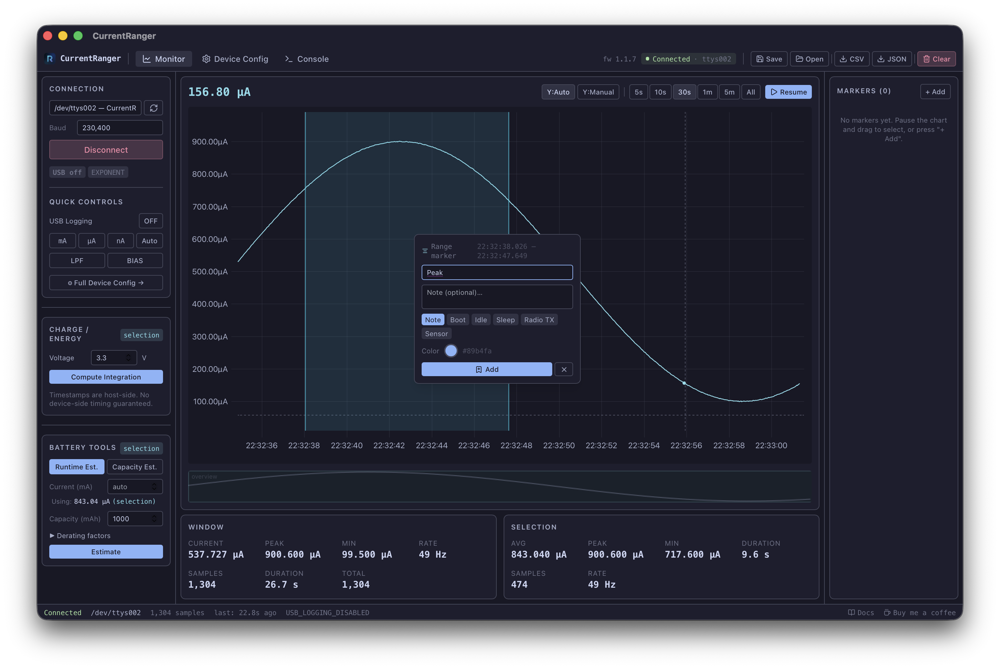
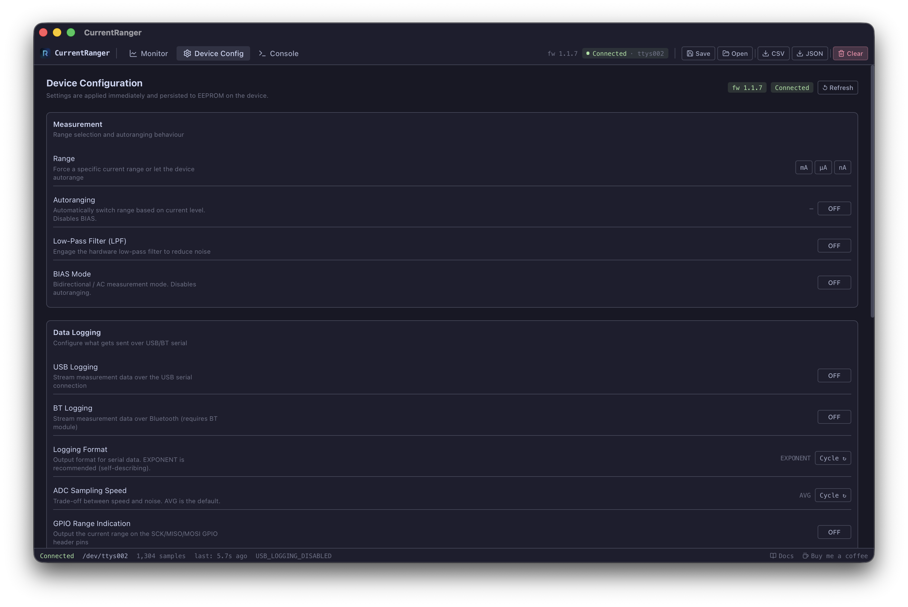

# CurrentRanger Desktop App

[](https://github.com/vitormhenrique/CurrentRangerApp/actions/workflows/release.yml)
[](https://github.com/vitormhenrique/CurrentRangerApp/releases)
[](LICENSE)
[](https://vitormhenrique.github.io/CurrentRangerApp/)
[](https://buymeacoffee.com/vitormhenrique)

A modern cross-platform desktop application for managing and analyzing data from a [LowPowerLab CurrentRanger](https://lowpowerlab.com/currentranger) precision current meter.

Built with **Rust + Tauri v2**, **React + TypeScript**, and **uplot** for high-performance real-time charting.


---

## Features

- **Serial connection** — auto-discovers ports, connects at 230400 baud
- **Device control panel** — all stock firmware commands: USB logging toggle, logging format, ADC speed, auto-off, range selection, LPF, BIAS/bidirectional, autoranging, calibration
- **Real-time chart** — live current vs time with smooth scrolling, zoom, pan, cursor inspection, drag selection; pause/resume without stopping capture
- **Live stats** — instantaneous, average, min, max current; sample rate; visible window stats
- **Selection stats** — avg/peak/min over any drag-selected region
- **Charge & energy integration** — Coulombs, mAh, Ah; Joules, Wh, mWh with user-configured voltage
- **Battery tools** — runtime estimator and required-capacity estimator with derating factors (regulator efficiency, depth of discharge, aging margin)
- **User markers** — annotate any point in time with labels, colors, categories (boot, idle, sleep, TX, sensor, note); rendered as vertical rules on chart



- **Workspace save/load** — full JSON workspace: samples, markers, settings, derived summaries, chart state
- **Data export** — CSV (time, current), JSON (with full metadata), marker export
- **Console** — built-in log viewer for troubleshooting serial communication and app events



---

## Installation

Download the latest release for your platform from the [Releases page](https://github.com/vitormhenrique/CurrentRangerApp/releases).

| Platform | File |
|----------|------|
| **macOS (Apple Silicon)** | `CurrentRanger_x.x.x_aarch64.dmg` |
| **macOS (Intel)** | `CurrentRanger_x.x.x_x64.dmg` |
| **Windows** | `CurrentRanger_x.x.x_x64-setup.exe` or `.msi` |
| **Linux (Debian/Ubuntu)** | `current-ranger_x.x.x_amd64.deb` |
| **Linux (AppImage)** | `CurrentRanger_x.x.x_amd64.AppImage` |

### macOS

1. Open the `.dmg` file
2. Drag **CurrentRanger** into your Applications folder
3. Launch the app normally

### Windows

1. Run the `.exe` installer (or `.msi` for system-wide install)
2. Follow the setup wizard
3. You may need to install a USB serial driver if your system doesn't recognize the CurrentRanger — the device uses a standard USB CDC ACM interface

### Linux

**Debian/Ubuntu:**
```bash
sudo dpkg -i current-ranger_x.x.x_amd64.deb
```

**AppImage:**
```bash
chmod +x CurrentRanger_x.x.x_amd64.AppImage
./CurrentRanger_x.x.x_amd64.AppImage
```

On Linux, you may need to add your user to the `dialout` group for serial port access:
```bash
sudo usermod -aG dialout $USER
# Log out and back in for the change to take effect
```

---

## Getting Started

1. Connect your CurrentRanger R3 via USB
2. Launch the application
3. The app will automatically detect and select the CurrentRanger serial port
4. Click **Connect** in the left panel
5. The device will automatically enable USB logging and begin streaming data

For full documentation, visit [vitormhenrique.github.io/CurrentRangerApp](https://vitormhenrique.github.io/CurrentRangerApp/).

---

## Development

The following is only needed if you want to build from source or contribute to the project.

### Requirements

| Tool | Version |
|------|---------|
| Rust + Cargo | ≥ 1.77 |
| Node.js | ≥ 18 |
| npm | ≥ 9 |
| just | any |
| Tauri system deps | see [Tauri prerequisites](https://v2.tauri.app/start/prerequisites/) |

### macOS
```
xcode-select --install
brew install just
```

### Linux (Debian/Ubuntu)
```
sudo apt install libwebkit2gtk-4.1-dev libssl-dev libayatana-appindicator3-dev librsvg2-dev
brew install just   # or: cargo install just
```

### Windows
Follow [Tauri Windows prerequisites](https://v2.tauri.app/start/prerequisites/#windows).

### Quick Start

```bash
# Install all deps (Node + Rust)
just install

# Start development (hot-reload frontend + live Tauri window)
just dev

# Run tests
just test

# Build release app
just build
```

---

## Project Structure

```
.
├── src/                    # Frontend (React + TypeScript)
│   ├── App.tsx
│   ├── main.tsx
│   ├── components/
│   │   ├── DevicePanel.tsx       # Connection + firmware command panel
│   │   ├── LiveChart.tsx         # uplot real-time chart
│   │   ├── StatsPanel.tsx        # Live + selection stats
│   │   ├── MarkersPanel.tsx      # Marker list + add/edit
│   │   ├── BatteryTools.tsx      # Runtime & capacity estimator
│   │   ├── WorkspacePanel.tsx    # Save/load/export workspace
│   │   └── IntegrationPanel.tsx  # Charge/energy integration
│   ├── store/
│   │   └── index.ts              # Zustand global store
│   └── types/
│       └── index.ts              # Shared TypeScript types
│
├── src-tauri/              # Rust backend
│   ├── Cargo.toml
│   ├── tauri.conf.json
│   └── src/
│       ├── main.rs
│       ├── lib.rs
│       ├── serial/               # Port discovery, connect/disconnect
│       ├── protocol/             # Line parser, device status parser
│       ├── data/                 # Sample store (ring buffer)
│       ├── metrics/              # Charge/energy integration, battery math
│       ├── workspace/            # Save/load versioned JSON workspace
│       ├── export/               # CSV + JSON export
│       └── commands/             # Tauri command handlers
│
├── justfile                # Developer task runner
├── task.md                 # Implementation tracker
└── README.md
```

---

## Protocol Notes (Stock Firmware)

The app targets stock **CurrentRanger R3 firmware** (tested up to v1.1.7). It makes no assumptions about features not present in the stock firmware.

### Default logging format: EXPONENT
Lines look like: `1234E-6` (= 1234 µA = 1.234 mA in amps). The mantissa is the raw ADC-derived voltage; the exponent encodes the current range (`-9` = nA, `-6` = µA, `-3` = mA).

### No device-side timestamps
All timestamps are assigned by the host on receipt. Jitter from OS scheduling and USB polling applies. The UI is transparent about this.

### USB logging must be enabled
The app sends `u` on connect to enable USB logging. If it was already enabled from a previous session, it toggles off then on again (matching the Python GUI reference behavior).

### Calibration commands
Commands `+`, `-`, `*`, `/`, `<`, `>` write to device EEPROM. The app confirms before sending these.

---

## Known Limitations

- ADC logging format (raw counts) is supported but requires knowing the current range for conversion; the app displays raw counts and notes the limitation.
- Bluetooth logging is device–serial-only (HC-06 UART). The USB connection is independent.
- No device-side sample rate guarantee; the app displays the measured host-side Hz.
- Autorange transitions are not explicitly signaled in the EXPONENT format — the range is embedded in the exponent.

---

## License

MIT
