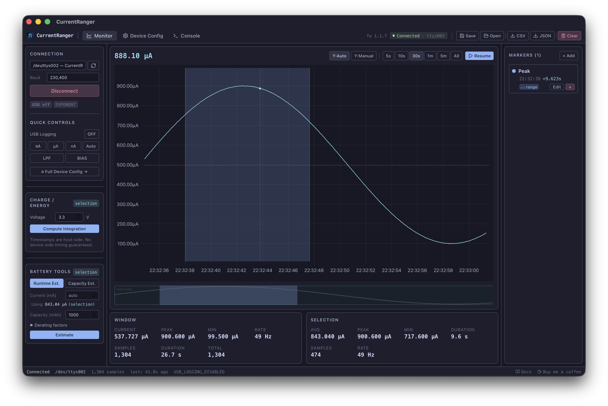

# Live Chart

## Overview

The live chart displays real-time current measurements using a high-performance uPlot renderer capable of displaying 500,000+ data points smoothly.

## Toolbar

| Control | Description |
|---------|-------------|
| **Live value** (top-left) | Shows the latest sample value when streaming, or the value under the cursor when paused |
| **Y:Auto / Y:Manual** | Toggle between automatic and manual Y-axis scaling |
| **5s, 10s, 30s, 1m, 5m, All** | Time window selection |
| **Pause / Resume** | Pause data capture and enable exploration; resume to continue streaming |

## Time Windows

Click a time window button to change the visible time range. When paused, the chart snaps to the most recent N seconds of data. When streaming, the chart auto-scrolls to show the latest window.

The **All** button shows the entire data buffer.

## Pausing and Resuming

- **Pause**: Stops USB data logging on the device and freezes the chart. You can now scroll, zoom, and make selections.
- **Resume**: Re-enables USB logging and resumes live scrolling. Any active selection is cleared.

## Scrolling and Navigation

When paused:
- Use the **minimap** (below the chart) to click or drag to any point in the data
- The chart viewport updates immediately with correct Y-axis scaling
- The minimap highlights the current viewport

## Cursor Value

When paused, hovering the chart shows the nearest sample value in the top-left readout. This updates in real-time as you move the cursor.

## Data Gaps

When USB logging is toggled off and back on, or when reconnecting, a line break is inserted so that separate acquisition sessions are not connected by a line.

## Selecting a Range

Click and drag on the chart to select a time range. The **Selection** stats panel below the chart shows statistics for the selected region.

- **Left-click** on empty chart area clears the selection
- **Left-click** on a saved range marker loads that marker's time range as the selection
- Changing the time window or resuming also clears the selection
