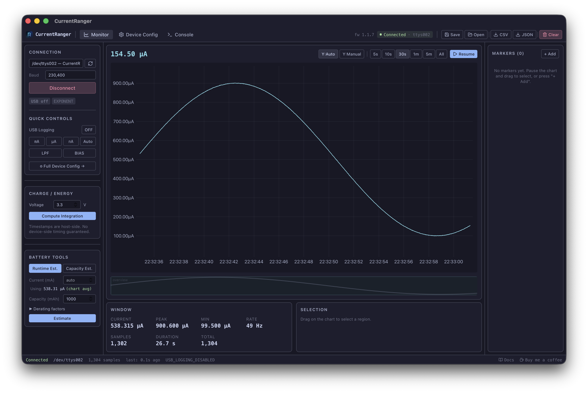

# CurrentRanger App

A desktop companion application for the [CurrentRanger R3](https://lowpowerlab.com/currentranger) precision current meter.

Built with **Rust + Tauri v2**, **React + TypeScript**, and **uPlot** for high-performance real-time charting.

## Features

- **Real-time current monitoring** with 50 Hz+ sample rates
- **Autoranging** across mA, uA, and nA ranges
- **Minimap** overview with click-to-navigate
- **Markers and annotations** (point and range markers with custom colors)
- **Charge / energy integration** (coulombs, mAh, joules, mWh)
- **Battery runtime estimation** with derating factors
- **Workspace save/load** for persistent sessions
- **CSV and JSON export**
- **Full device configuration** panel (LPF, BIAS, autoranging, calibration, etc.)

## Pages

- [Getting Started]({{ "Getting-Started/" | relative_url }})
- [Connecting to a Device]({{ "Connecting/" | relative_url }})
- [Live Chart]({{ "Live-Chart/" | relative_url }})
- [Markers and Annotations]({{ "Markers/" | relative_url }})
- [Charge and Energy Integration]({{ "Integration/" | relative_url }})
- [Battery Tools]({{ "Battery-Tools/" | relative_url }})
- [Device Configuration]({{ "Device-Config/" | relative_url }})
- [Workspaces and Export]({{ "Workspaces/" | relative_url }})
- [Console]({{ "Console/" | relative_url }})
- [Mock Device for Testing]({{ "Mock-Device/" | relative_url }})
- [Keyboard Shortcuts]({{ "Keyboard-Shortcuts/" | relative_url }})

## Links

- [GitHub Repository](https://github.com/vitormhenrique/CurrentRangerApp)
- [CurrentRanger Hardware](https://lowpowerlab.com/currentranger)
- [Buy me a coffee](https://www.paypal.com/donate/?business=NT46DHPPPSBBU&no_recurring=0&item_name=buy+me+a+coffee&currency_code=USD)
